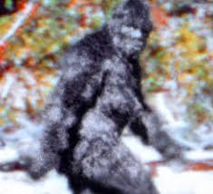
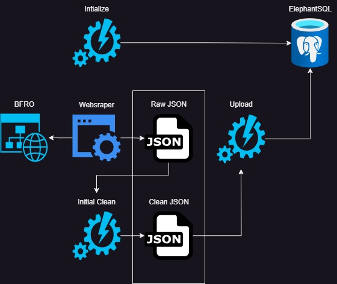

# README Out of date since code reformat.


#### Updated 2/23/2024

# Bigfoot Tracking and Analysis Project - Version 1.3


## Overview
The Bigfoot Tracking and Analysis Project is an automated system designed to collect and analyze sightings of Bigfoot from the Bigfoot Field Researchers Organization (BFRO) website.  

## Version 1.3
- Major restructure of files.  Easier to understand.
- inserted error handling.
## Version 1.2
- Introduction of new main script that replaces original bash script
- Removed scraping recent sightings, may add again in future but currently the project drops the whole database every time it runs.
- Removes local files after uploading to database
## Version 1.1
- Determines whether the entire website should be scraped or only the recent sightings
- Runs webscraping tools
- Cleans columns of unwanted keys from the webscraping process
- Inserts json data into PostgreSQL databse

## Components
### File Structure
- `bigfoot_factory/sql_commands/create_table.py`
- `bigfoot_factory/sql_commands/insert_data.py`
- `bigfoot_factory/sql_commands/stored_proc_python.py`
- `bigfoot_factory/clean_db.py`
- `bigfoot_factory/db_check.py`
- `bigfoot_factory/initiate_db.py`
- `bigfoot_factory/update_db.py`
- `datalake/bfro_data.json`
- `datalake/cleaned_columns_bfro_data.json`
- `media/`
- `webscrapers/`

### Packages Used
- `beautifulsoup`
- `psycopg2`
- `dotenv`

## Workflow

1. **Initializes Database:**
    - Drops database in ElephantSQL if it exists and creates new one.
2. **Web Scraping:**
    - runs `complete_webscrape.py`
3. **Clean Data:**
    - Cleans unwanted columns
    - Slight formatting
4. **Updates Database:**
    - Uploads cleaned json to ElephantSQL hosted database
5. **Drops local files**
    - Removes all local files to keep a clean workspace

## Release Plan
- **Version 1.2:**
    - Clean year and date column.
    - Clean submitted_by column.
    - Clean follow_up colum.
- **Version 1.3:**
    - Automate SQL Stored Procedures using python script
    - Clean nearest_town columns.

## Installation and Execution
*Note:* This project uses python3.
1. **Clone Repository:**
    ```bash
    git clone https://github.com/CollinClifford/bf_proj
    cd bf_proj
2. **Install Dependencies:**
    ```bash
    pip install -r requirements.txt
3. **Configure Environment Variables:**
    Create a `.env` file in the project root with the necessary environment variables with the following as a template.
    ```bash
    # Database connections
    DB_HOST=
    DB_NAME=
    DB_USER=
    DB_PASSWORD=
    DB_PORT=
    SSL_MODE=disable
4. **Run the Program:**
    - Execute the bash script:
    ```bash
    python3 ./main.py

This setup should ensure a seamless installation and execution of the Bigfoot Tracking and Analysis Project.  Please reach out to *collinclifford@ymail.com* for any questions.